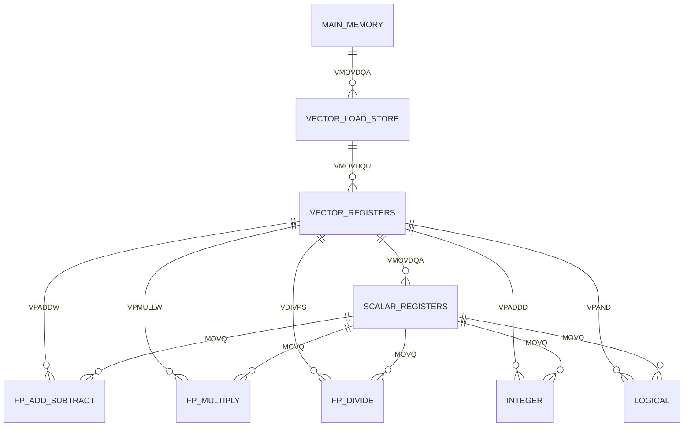

# SIMD

```mermaid
erDiagram
    MAIN_MEMORY ||--o{ VECTOR_LOAD_STORE : VMOVDQA
    VECTOR_LOAD_STORE ||--o{ VECTOR_REGISTERS : VMOVDQU
    VECTOR_REGISTERS ||--o{ SCALAR_REGISTERS : VMOVDQA
    VECTOR_REGISTERS ||--o{ FP_ADD_SUBTRACT : VPADDW
    VECTOR_REGISTERS ||--o{ FP_MULTIPLY : VPMULLW
    VECTOR_REGISTERS ||--o{ FP_DIVIDE : VDIVPS
    VECTOR_REGISTERS ||--o{ INTEGER : VPADDD
    VECTOR_REGISTERS ||--o{ LOGICAL : VPAND
    SCALAR_REGISTERS ||--o{ FP_ADD_SUBTRACT : MOVQ
    SCALAR_REGISTERS ||--o{ FP_MULTIPLY : MOVQ
    SCALAR_REGISTERS ||--o{ FP_DIVIDE : MOVQ
    SCALAR_REGISTERS ||--o{ INTEGER : MOVQ
    SCALAR_REGISTERS ||--o{ LOGICAL : MOVQ
```
